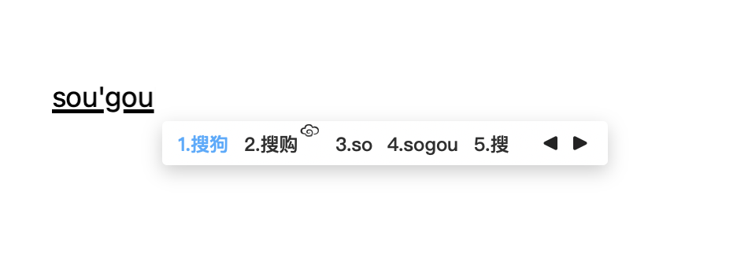
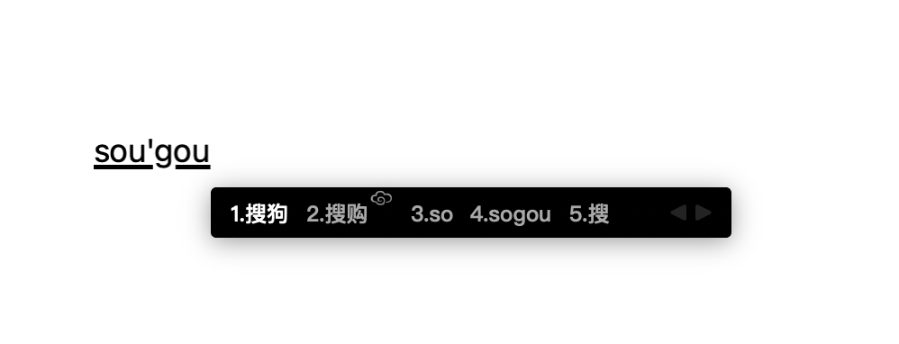

## 自用的搜狗皮肤

我的电脑上是居中是正常。

不要选择「随字体缩放」的设置。

目前两款：

- 黑色，修改自[xincreate/DeepSilence-II: 搜狗输入法皮肤 (github.com)](https://github.com/mitoop/sougou-skin/blob/master/程序黑.mssf)

- 白色，修改自[intret/PureBlue: 空蓝 (github.com)](https://github.com/intret/PureBlue)

  

原设计信息归原作者所有，仅仅按照我自己的喜好修改了一点点细节，**如果你也喜欢候选框不那么高的话，可以试试。**

- 高度是 70 x 28 -> 140 x 56
- 弧度 6.1px
- 阴影 6，0，-4，#3a0a0f29 （白色）/  #66000000（黑色）
- 背景相对位置，5px(top) 0px(left)
- 候选项相对位置-5 7 4 53（上、左、下、右）

~~如果搜狗支持深色模式自动切换就好了~~

我个人比较喜欢纯色的，白色/黑色

如果有好看的，也欢迎 pr 提交。